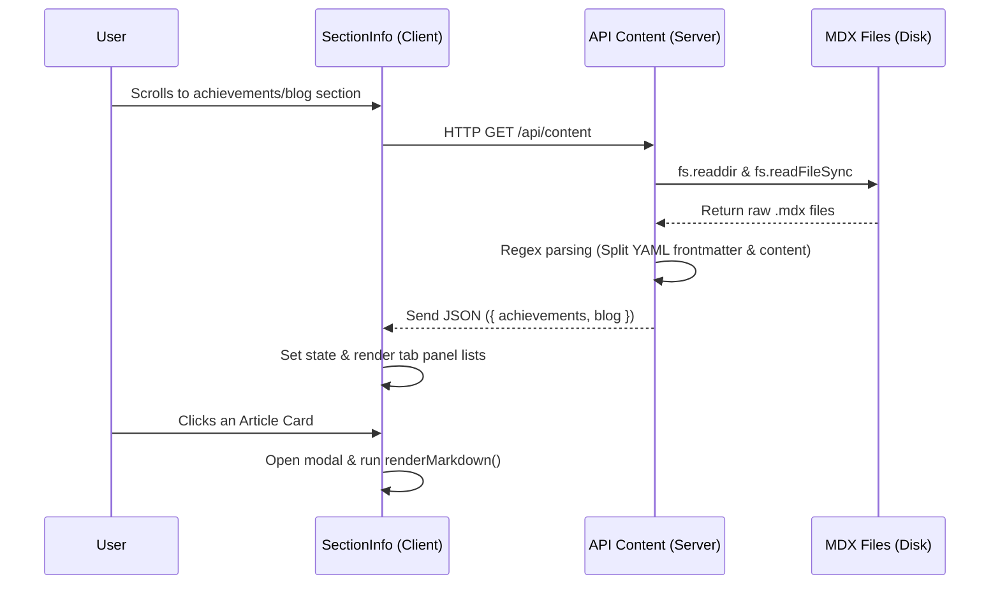
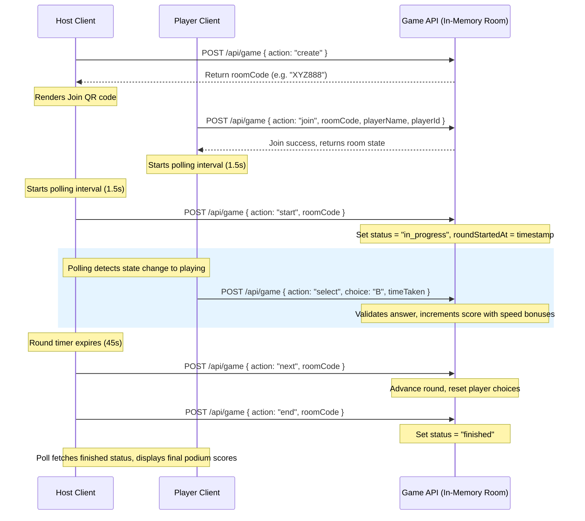

# Mekong Pathfinder Codebase Analysis

This document provides a detailed breakdown of the codebase architecture, folder structure, state management, coding conventions, API flow, and components hierarchy for the **Mekong Pathfinder** application.

---

## 1. Architecture

Mekong Pathfinder is a modern web application built using **Next.js 16 (App Router)** and **React 19**. It features highly interactive visual systems like custom WebGL animations and real-time maps.

    ### Technical Stack & Key Modules
    *   **Frontend Core**: React 19.2, Next.js 16.2 (utilizing TypeScript).
    *   **Styling**: Tailwind CSS v4 configured via `@tailwindcss/postcss`. However, styling heavily relies on custom vanilla CSS tokens (variables) defined in [globals.css](file:///d:/2026/Code/new/mekong-pathfinder/styles/globals.css) to support smooth transitions, animations, and high-fidelity themes.
    *   **3D Visualizations**: [Three.js](https://threejs.org/) (`three` package) is used to draw an interactive 3D map of Cần Thơ City inside the hero component, showing real-time rain, flood alerts, and pathfinding routes.
    *   **Maps**: [Leaflet](https://leafletjs.org/) is loaded dynamically on the client side for rendering GIS maps, plotting safe routes, and highlighting flooded regions.
    *   **Icons**: [Lucide React](https://lucide.dev/) for vector icons.

### Client-Server Architecture
1.  **Static/Dynamic Content Generation**: Simple server-side API endpoints parse static `.mdx` files (blog, achievements) and return them as JSON to avoid heavy client-side MDX dependencies.
2.  **Multiplayer Game Engine**: The multiplayer game is orchestrated by an in-memory route cache in [api/game/route.ts](file:///d:/2026/Code/new/mekong-pathfinder/app/api/game/route.ts) that handles client connections, status updates, and scores via polling.

---

## 2. Folder Structure

Below is the directory mapping of the workspace:

```
mekong-pathfinder/
├── app/                              # Next.js App Router root
│   ├── api/                          # REST API Endpoints
│   │   ├── content/
│   │   │   └── route.ts              # Reads & parses MDX content dynamically
│   │   └── game/
│   │       └── route.ts              # Game engine backend (multiplayer rooms)
│   ├── game/
│   │   └── page.tsx                  # Interactive Game (Solo vs AI, Host view, Player controller)
│   ├── layout.tsx                    # Root HTML shell, fonts (Be Vietnam Pro), leaflet styles
│   └── page.tsx                      # Landing Page entry point
├── components/                       # Reusable UI sections & functional elements
│   ├── Footer.tsx                    # Branding footer
│   ├── Header.tsx                    # Sticky header with light/dark theme switch
│   ├── Hero.tsx                      # Three.js 3D animation visualizer
│   ├── SectionAISolution.tsx         # AI model explanation panel
│   ├── SectionCTA.tsx                # Action redirect container
│   ├── SectionContact.tsx            # Feedback / Inquiry form
│   ├── SectionFeatureExperience.tsx  # Dynamic Leaflet map with routing features
│   ├── SectionInfo.tsx               # Content tab section (loading dynamic achievements/blogs)
│   ├── SectionIntro.tsx              # Platform summary
│   ├── SectionProductDemo.tsx        # Video walkthrough using lazy YouTube iframe
│   ├── SectionStory.tsx              # Motivation / Mission section
│   ├── SectionTeam.tsx               # Member profile grid
│   └── VideoIntro.tsx                # Cinematic MP4 intro overlay with scroll block and fade-out
├── content/                          # Static content files
│   ├── achievements/                 # MDX files with YAML frontmatter (achievements)
│   └── blog/                         # MDX files with YAML frontmatter (articles)
├── assets/                           # Raw graphic assets
│   ├── cv_team/                      # Team resume resources
│   ├── images/                       # UI diagrams and vector icons
│   └── mk_intro.mp4                  # Introduction overlay video
├── public/                           # Exposed static files (images, next/vercel logos)
├── styles/
│   └── globals.css                   # Master styling file, containing CSS variables and theme rules
└── configuration files               # package.json, next.config.ts, tailwind.config.ts, etc.
```

---

## 3. State Management

The application keeps state lean and fast without heavy global libraries like Redux or Zustand:

*   **Global Theme State**:
    *   Stored in `localStorage` under the key `'mp-theme'`.
    *   Synchronized by setting the `data-theme` attribute on the root `<html>` element (`data-theme="dark"` or `"light"`).
    *   Handled in [Header.tsx](file:///d:/2026/Code/new/mekong-pathfinder/components/Header.tsx) and [game/page.tsx](file:///d:/2026/Code/new/mekong-pathfinder/app/game/page.tsx).
*   **Client Component Local State**:
    *   Managed using standard React hooks (`useState`, `useRef`, `useCallback`).
    *   Map states (Leaflet object instance, active markers, route polylines) are stored in React references (`useRef`) to prevent unnecessary component re-renders.
*   **Game Multiplayer State**:
    *   **Backend Cache**: Kept in-memory via global variables on the Node process (`(global as any).gameRooms = rooms || new Map()`) to persist game rooms across REST requests.
    *   **Client Synchronization**: Client devices poll the backend status `/api/game` at a regular interval (`setInterval` every `1500ms`) to retrieve the latest player listing, scores, and round status.

---

## 4. Coding Conventions

*   **Next.js 16 App Router Standards**: Uses modern directory layout. Directives like `'use client'` are explicitly placed at the top of client-side interactive files.
*   **CSS Design System & Variables**: Layouts use utility styles mixed with semantic class names pointing to CSS custom properties defined in [globals.css](file:///d:/2026/Code/new/mekong-pathfinder/styles/globals.css). This keeps colors, typography, margins, and borders consistent between dark and light modes.
*   **TypeScript Types & Interfaces**: Structures like games (`Player`, `Room`, API payload actions) or markdown posts (`MDXArticle`) are strictly defined.
*   **Inline Helper Components**: Small graphical widgets (like inline SVGs, theme icons, or specialized components) are written directly within their parent files rather than cluttered in separate files.
*   **Lazy Loading & Performance Tweaks**:
    *   Videos/Iframes are loaded on-demand or closed with pre-emptive fade-outs to skip trailing black frames (as seen in [VideoIntro.tsx](file:///d:/2026/Code/new/mekong-pathfinder/components/VideoIntro.tsx)).
    *   MDX text parsing is done with a fast split-based custom compiler rather than parsing full ASTs to keep bundle sizes minimal.

---

## 5. API Flow

### Content API Flow (Reading MDX)
The flow of fetching and displaying static MDX files is described below:



### Multiplayer Game Flow
The following sequence details how game rooms are generated, updated, and synchronized:



---

## 6. Components Hierarchy

### Main Landing Page Component Tree
The homepage ([app/page.tsx](file:///d:/2026/Code/new/mekong-pathfinder/app/page.tsx)) acts as a wrapper that structuralizes sections sequentially:

```
HomePage
├── VideoIntro (Overlay)
├── Header (Navbar, Logo, scroll listeners)
├── Hero (WebGL canvas container)
│   └── Canvas element (Managed by custom Three.js renderer hook)
├── SectionStory (Mission statement)
├── SectionIntro (General features grid)
├── SectionAISolution (Diagram display and steps)
├── SectionProductDemo (Interactive YouTube video container)
├── SectionFeatureExperience (Leaflet mapping client)
│   ├── Search overlay
│   ├── Floating map controls & filter checkboxes
│   └── Map container (Leaflet script initialization)
├── SectionInfo (Content feed)
│   ├── Tab navigators
│   └── Article detail modal
├── SectionTeam (Profiles)
├── SectionContact (Feedback textareas)
├── SectionCTA (Final redirections)
└── Footer (Branding credits)
```

### Game Page Component Tree
The game subpage ([app/game/page.tsx](file:///d:/2026/Code/new/mekong-pathfinder/app/game/page.tsx)) renders dynamic states depending on the chosen mode:

```
GamePage
├── Sticky Game Header (Branding horizontal logo, back button, theme switch)
└── Rendering Mode Switcher
    ├── MODE selection (Solo, Host display, Mobile controller options)
    ├── SoloGameComponent
    │   ├── Name Entry Lobby
    │   ├── Grid layout (Active round indicators, remaining timer)
    │   │   ├── Route Cards (Click to lock route)
    │   │   └── Bot Leaderboard sidebar (Calculates bot simulation points)
    │   ├── Result Explanation panel (Shows stats distribution, AI comments)
    │   └── Game Over Podium (Final medal awards)
    ├── HostGameComponent
    │   ├── Waiting Room (Room Code display, QR Code block, Active players listing)
    │   ├── In-Progress Room (Countdown meter, Answers count, realtime choices bar charts)
    │   ├── Explanation slide (Shows correct answer and explanation text)
    │   └── Finished Room (Podium listing top players)
    └── PlayerGameComponent
        ├── Join Form (Code verification, Player name text field)
        ├── Player Waiting lobby (Active pulse loader)
        └── Controller game panel (Timer bar, Choice locking buttons)
```
